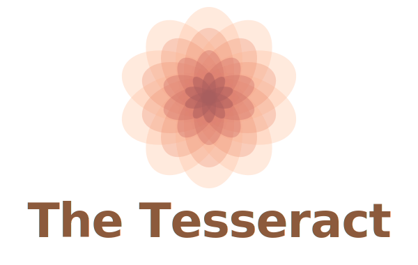

<p align="center">
  
</p>

A multi-agent workflow system for Claude that parallelises the full feature lifecycle — from ideation through implementation, testing, documentation, PR crafting, and review feedback triage.

---

## 💡 Philosophy

Your job is to **orchestrate and review**, not to produce. Claude handles production across parallel streams. The bottleneck moves from "writing things" to "deciding things."

Don't Panic.

---

## 🧑‍🚀 The Crew

| Agent | Role | Personality |
|-------|------|-------------|
| 🫩 **Odysseus** | Architect & Planner | The man of many plans — charts the course through treacherous waters |
| 🪨 **Rocky** | Implementer | The Eridian engineer from Project Hail Mary — "I am engineer!" |
| 🤖 **Marvin** | QA & Test Engineer | The Paranoid Android — brain the size of a planet, expects everything to fail |
| 🐠 **Babel** | Documentation & Diagrams | The Babel Fish — translates code across all dimensions |
| 🧿 **Muad'Dib** | PR & Commit Crafter | The Kwisatz Haderach — sees all possible futures of a pull request |
| 🐭 **Ratatouille** | Feedback Triager | Anton Ego — the devastating critic whose judgment is final |

---

## 🔄 Workflow

```
You ──→ 🫩 Odysseus (plan) ──→ APPROVE
                │
    ┌───────────┼───────────┐
    ▼           ▼           ▼
 🪨 Rocky    🤖 Marvin    🐠 Babel
 (code)      (tests)      (docs)
    │           │           │
    └─────┬─────┘           │
          ▼                 │
    Coverage >80%           │
          │                 │
          └────────┬────────┘
                   ▼
            🧿 Muad'Dib (PR)
                   │
                   ▼
            Review Feedback
                   │
                   ▼
           🐭 Ratatouille (triage)
                   │
                   ▼
              PR Merged ✓
```

---

## 🚀 Quick Start

### Dashboard

```bash
make dashboard
```

Opens `http://localhost:3000` in your browser. No build step, no Node.js — Python 3 only.

The dashboard auto-syncs with your `plans/` directory, GitHub activity, and Claude Code token usage. Data refreshes every 5 seconds and only re-renders when something changes.

### 🌐 Custom Local Hostname

Give it a proper URL instead of `localhost:3000`:

```bash
echo '127.0.0.1 tesseract.local' | sudo tee -a /etc/hosts
```

Then bookmark `http://tesseract.local:3000`. This is just a DNS alias — it doesn't affect any other services.

---

## ⚙️ Setup

### 🔑 Environment Variables

Add these to your `~/.zshrc` (or `~/.bashrc`):

```bash
# GitHub Pulse widget
export GITHUB_USERNAME="your-github-username"
export GITHUB_TOKEN="ghp_your_token_here"
export GITHUB_ORG="your-org-name"          # optional, for org repos
```

Token usage is tracked automatically by scanning `~/.claude/projects/` — no API key needed.

Reload after adding:

```bash
source ~/.zshrc
```

### 🐙 GitHub Token

The GitHub Pulse widget shows your commit heatmap and recent pushes across all repos.

**Creating the token:**

1. Go to [github.com/settings/tokens](https://github.com/settings/tokens) → **Generate new token (classic)**
2. Name: `Tesseract Dashboard`
3. Scopes: `repo` and `read:org`
4. Generate and copy (starts with `ghp_...`)

**If your org uses SAML SSO:** after creating the token, click **Configure SSO** next to it and authorize for your org. Without this, org events return a 403.

**Why classic?** Fine-grained tokens don't support the `events/orgs/{org}` endpoint. For personal-only activity, a fine-grained token with **Account → Events → Read-only** works fine.

### 🔒 Claude Code Permissions

Allow Claude Code to read agent files without prompting. Edit `~/.claude/settings.json`:

```json
{
  "permissions": {
    "allow": [
      "Read:~/Projects/the-tesseract/**"
    ]
  }
}
```

Adjust the path to wherever you cloned this repo.

---

## 🧭 Global Agent Routing

Invoke agents by name from any project — no need to type file paths.

### Option 1: Global CLAUDE.md (recommended)

Create `~/.claude/CLAUDE.md`:

```markdown
# The Tesseract — Agent Routing

When a message starts with an agent name, read the corresponding
SYSTEM.md and adopt that persona for the entire session:

- odysseus → ~/Projects/the-tesseract/agents/odysseus/SYSTEM.md
- rocky → ~/Projects/the-tesseract/agents/rocky/SYSTEM.md
- marvin → ~/Projects/the-tesseract/agents/marvin/SYSTEM.md
- babel → ~/Projects/the-tesseract/agents/babel/SYSTEM.md
- muaddib → ~/Projects/the-tesseract/agents/muaddib/SYSTEM.md
- ratatouille → ~/Projects/the-tesseract/agents/ratatouille/SYSTEM.md

Always read the SYSTEM.md before responding. Stay in character.
Also read ~/Projects/the-tesseract/CLAUDE.md for shared standards.
```

Now from any project:

```bash
claude "rocky: Implement the auth middleware refresh token rotation"
claude "marvin: Write tests for the payment retry logic"
```

### Option 2: Shell Commands

```bash
mkdir -p ~/Projects/the-tesseract/bin

for agent in odysseus rocky marvin babel muaddib ratatouille; do
cat > ~/Projects/the-tesseract/bin/$agent << 'SCRIPT'
#!/usr/bin/env bash
T="${TESSERACT_HOME:-$HOME/Projects/the-tesseract}"
claude "Read ${T}/agents/AGENT_NAME/SYSTEM.md and adopt that persona. Also read ${T}/CLAUDE.md for shared standards. Then: $*"
SCRIPT
sed -i '' "s/AGENT_NAME/$agent/" ~/Projects/the-tesseract/bin/$agent
chmod +x ~/Projects/the-tesseract/bin/$agent
done
```

Add to `~/.zshrc`:

```bash
export TESSERACT_HOME="$HOME/Projects/the-tesseract"
export PATH="$TESSERACT_HOME/bin:$PATH"
```

Then from anywhere:

```bash
rocky "Implement plans/payment-idempotency.md"
marvin "Write tests for the retry logic"
```

---

## 💻 Usage

### With Claude Code (CLI)

```bash
# 1. Plan with Odysseus
claude "odysseus: I want to implement payment idempotency keys."

# 2. Fan out in parallel terminals once approved:
claude "rocky: Implement the plan at plans/payment-idempotency.md"
claude "marvin: Write tests for plans/payment-idempotency.md"
claude "babel: Document plans/payment-idempotency.md"

# 3. PR
claude "muaddib: Write the PR for plans/payment-idempotency.md"

# 4. Feedback triage
claude "ratatouille: Triage these comments: [paste feedback]"
```

### With Claude.ai

Open separate conversations for each agent. Paste the relevant `SYSTEM.md` as the first message, then reference the plan document.

---

## 📊 Dashboard Features

- **Agents** — Grid with live blinking indicators showing which agents are active based on plan status
- **Plans** — auto-synced from `plans/*.md`. Click to expand and see checklist items grouped by section with agent attribution
- **Token Usage** — auto-scanned from `~/.claude/projects/` session logs. 14-day sparkline. Works on Pro, Max, and API plans
- **Plan Pipeline** — compact kanban across all statuses
- **GitHub Pulse** — 28-day commit heatmap + recent commit messages from personal and org repos
- **Recent Activity** — unified feed of plan changes and git commits, auto-attributed to agents

---

## 🛠️ Makefile Commands

| Command | Description |
|---------|-------------|
| `make dashboard` | Start the dashboard |
| `make stop` | Stop the dashboard server |
| `make new-plan NAME=feature-name` | Create a new plan from template |
| `make clean` | Remove completed plans |
| `make help` | Show all commands |

---

## 🎨 Customisation

**Adapt to your stack** — edit `CLAUDE.md` to reflect your language, framework, testing tools, and conventions.

**Add agents** — create a new directory under `agents/` with a `SYSTEM.md` and add the agent to the table in `CLAUDE.md`.

**GitHub integration** — set `GITHUB_USERNAME`, `GITHUB_TOKEN`, and optionally `GITHUB_ORG`. The server filters to only your activity and shows only code-relevant events.

**Token tracking** — fully automatic via Claude Code session logs at `~/.claude/projects/`. No configuration needed.

---

<p align="center">
  
</p>