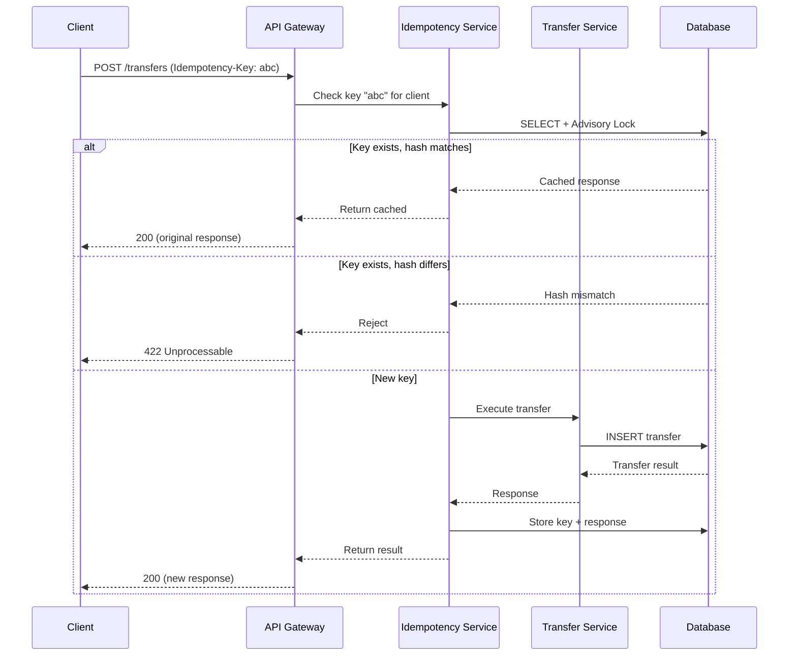

# Feature Plan: Payment Idempotency Keys

> **Status**: `APPROVED`
> **Created**: 2026-04-18
> **Last Updated**: 2026-04-19
> **Author**: Engineer
> **Agent**: Blueprint

---

## 1. Overview
Add idempotency key support to the payment transfer endpoint. Clients will send an `Idempotency-Key` header with each request. Duplicate requests with the same key return the original response without re-executing the transfer.

## 2. Motivation
Unreliable networks cause clients to retry payment requests. Without idempotency, retries can result in duplicate transfers — a critical financial error. Several enterprise clients have flagged this as a blocker for integration.

## 3. Requirements

### Functional
- [x] Accept `Idempotency-Key` header (UUID v4 format) on `POST /transfers`
- [x] Store key + response for 24 hours
- [x] Return cached response for duplicate keys (same status code, body, headers)
- [x] Reject mismatched requests (same key, different payload) with 422
- [x] Handle concurrent requests with the same key (only one executes)

### Non-Functional
- Performance: Key lookup must add <5ms p99 latency
- Availability: Idempotency store failure must not block transfers (fail-open with logging)
- Security: Keys are scoped per API client — client A's key cannot collide with client B's

## 4. Technical Design

### 4.1 Data Model Changes
```sql
CREATE TABLE idempotency_keys (
    id            UUID PRIMARY KEY DEFAULT gen_random_uuid(),
    client_id     UUID NOT NULL REFERENCES api_clients(id),
    idempotency_key VARCHAR(255) NOT NULL,
    request_hash  VARCHAR(64) NOT NULL,  -- SHA-256 of request body
    response_code INTEGER NOT NULL,
    response_body JSONB NOT NULL,
    created_at    TIMESTAMPTZ NOT NULL DEFAULT NOW(),
    expires_at    TIMESTAMPTZ NOT NULL DEFAULT NOW() + INTERVAL '24 hours',
    UNIQUE(client_id, idempotency_key)
);

CREATE INDEX idx_idempotency_lookup ON idempotency_keys(client_id, idempotency_key)
    WHERE expires_at > NOW();
```

### 4.2 API Contracts
```
POST /transfers
Headers:
  Authorization: Bearer <token>
  Idempotency-Key: <uuid-v4>  (required)
Request:  { "from": "acc_123", "to": "acc_456", "amount": "100.00", "currency": "USD" }
Response: { "transfer_id": "txn_789", "status": "completed", ... }

Errors:
  400 — Missing or invalid Idempotency-Key format
  422 — Key reused with different request payload
  409 — Concurrent request in progress for this key (retry after)
```

### 4.3 Business Logic
1. Extract key from header, validate UUID format
2. Hash the request body (SHA-256)
3. Attempt to acquire a row-level advisory lock on (client_id, key)
4. If lock acquired: check for existing key
   a. Key exists + hash matches → return cached response
   b. Key exists + hash differs → return 422
   c. Key doesn't exist → execute transfer, store result, return
5. If lock not acquired: return 409 with Retry-After header

### 4.4 Sequence Diagram


### 4.5 Dependencies
- External services: None (self-contained)
- Internal services: Transfer Service, Auth Service
- Libraries: None new — using existing crypto for SHA-256

## 5. Edge Cases & Error Handling
| Scenario | Expected Behavior |
|----------|-------------------|
| Key header missing | 400 with clear error message |
| Key not UUID v4 format | 400 with format guidance |
| Same key, different body | 422 with explanation |
| Concurrent duplicate requests | First executes, second gets 409 |
| Idempotency DB down | Fail-open: process transfer, log warning |
| Transfer fails after key stored | Store the error response — retries get same error |
| Key expired (>24h) | Treat as new key |
| Key at exactly 24h boundary | Expires — clock skew handled by 5-min grace period |

## 6. Security & Compliance
- [x] Keys scoped per client — no cross-client collision possible
- [x] Request body is hashed, not stored as plaintext for comparison
- [x] Advisory locks prevent race conditions on financial operations
- [x] Audit log entry for every idempotent replay
- [ ] No PII in idempotency_keys table (only references)

## 7. Acceptance Criteria
- [x] New transfer with idempotency key succeeds normally
- [x] Duplicate request returns identical response without re-executing
- [x] Same key + different payload returns 422
- [x] Concurrent duplicate requests: only one executes
- [x] Keys expire after 24 hours
- [x] <5ms p99 latency added to transfer endpoint
- [x] Idempotency store failure doesn't block transfers

## 8. Risk Register
| Risk | Impact | Likelihood | Mitigation |
|------|--------|------------|------------|
| Advisory lock contention | Med | Low | Lock timeout of 100ms, fail to 409 |
| Idempotency table growth | Low | Med | TTL index, nightly cleanup job |
| Clock skew on expiry | Low | Low | 5-minute grace period |

## 9. Rollback Plan
1. Feature flag: `IDEMPOTENCY_ENABLED` — set to false to bypass all idempotency logic
2. Endpoint continues to work without the header when flag is off
3. Migration is additive (new table) — no destructive schema changes
4. Cleanup: drop table + remove flag after rollback window (1 week)

## 10. Open Questions
- (resolved) Key format: UUID v4 — confirmed with client integration team
- (resolved) TTL: 24 hours — matches industry standard, confirmed with product

---

## Revision History
| Date | Change | Author |
|------|--------|--------|
| 2026-04-18 | Initial draft | Blueprint |
| 2026-04-18 | Added concurrent request handling | Blueprint |
| 2026-04-19 | Approved after review | Engineer |
