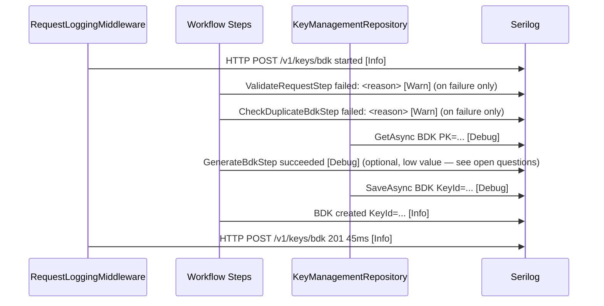

# Feature Plan: PCS Operational Logging Resilience

> **Status**: `DRAFT`
> **Created**: 2026-04-21
> **Last Updated**: 2026-04-21
> **Author**: Varun Horril
> **Agent**: Odysseus

---

## 1. Overview

The Payment Cryptography Service has a well-structured Serilog setup and correct sensitive-data discipline, but 65 of 74 workflow steps emit no log output, the repository layer is entirely silent, and several key lifecycle log steps are unimplemented stubs. This plan adds operational observability across workflow steps, persistence operations, and key lifecycle events so that engineers can diagnose failures and trace requests without relying on the DynamoDB audit record.

DynamoDB is the authoritative audit trail (1-year retention). Application logs serve a different purpose: day-to-day operational visibility, step-level failure diagnosis, and fast feedback during development and QA. These two concerns must remain clearly separated.

## 2. Motivation

The project is pre-live, making this the right time to establish logging discipline before operational habits form. The gaps identified are:

- When a workflow fails, there is no log signal between the HTTP-level 4xx/5xx and the exception — it is impossible to determine which step failed without reading DynamoDB
- Validation failures throw exceptions silently; the validation rule that triggered is never recorded
- Key lifecycle stubs (`LogKeyDeletedStep`, `LogKeyActivatedStep`) throw `NotImplementedException` — if these workflows are exercised during QA, failures will be confusing
- BDK create/import operations have no log coverage despite AWK and ZMK operations being logged
- Repository (DynamoDB) read/write operations have zero visibility — transient failures or unexpected empty results are invisible until a downstream step breaks

Key export is explicitly out of scope for this plan.

## 3. Requirements

### Functional

- [ ] Every workflow step emits a structured log entry on failure (exception or validation rejection), including step name, workflow name, and the reason for failure
- [ ] All workflow steps that perform a key lifecycle state change (create, import, activate, rotate, delete) emit an `Information`-level log entry on success
- [ ] `LogKeyDeletedStep` and `LogKeyActivatedStep` are implemented (not stubs)
- [ ] BDK create and import operations are logged at parity with AWK operations
- [ ] `KeyManagementRepository` emits `Debug`-level logs for all DynamoDB operations (read/write) and `Warning`-level logs for unexpected empty results or write failures
- [ ] No log entry introduces PII (PAN, PIN block, raw key material, credentials) — existing `SensitiveDataMasker` patterns apply

### Non-Functional

- **Performance:** Log calls must be non-blocking; no synchronous I/O in log steps. Serilog's existing async sink configuration covers this.
- **Security:** No PAN, PIN block, KSN, or key material in any log message. Key identifiers (aliases, IDs) are acceptable as they carry no cryptographic value.
- **Consistency:** All structured log properties follow existing naming conventions (`KeyId`, `Network`, `CorrelationId`, `WorkflowName`, `StepName`, `ElapsedMs` where relevant).

## 4. Technical Design

### 4.1 Data Model Changes

None. No new DynamoDB tables or schemas. Log output goes to existing Serilog sinks (Datadog in production, Seq in development).

### 4.2 API Contracts

None. This plan introduces no new or modified HTTP endpoints.

### 4.3 Business Logic

#### Log level conventions (reinforced, not new)

| Scenario | Level |
|----------|-------|
| Successful key lifecycle event (create, import, activate, rotate, delete) | `Information` |
| Validation failure (step rejects request) | `Warning` |
| Unexpected empty result from DynamoDB (key not found when expected) | `Warning` |
| DynamoDB operation success (reads, writes) | `Debug` |
| Unhandled exception in a step | `Error` |
| Non-primary AWK tier used (already implemented) | `Warning` |

#### What goes in each log entry

**Workflow step failure (validation or exception):**
```
WorkflowName, StepName, Reason, CorrelationId
```

**Key lifecycle success:**
```
KeyId (or alias), Network (where applicable), Operation, CorrelationId
```

**Repository operation:**
```
Operation (GetAsync/SaveAsync/QueryAsync/AppendEventAsync), EntityType, KeyId (or PK), ElapsedMs, Success
```

#### Implementing stub steps

`LogKeyDeletedStep` and `LogKeyActivatedStep` follow the exact same pattern as `LogKeyRotatedStep` and `LogKeyImportedStep`. They retrieve the relevant key ID from `WorkflowContext` and emit an `Information` log entry. No new abstractions needed.

#### BDK logging parity

Add `LogBdkCreatedStep` and `LogBdkImportedStep` following the `LogKeyCreatedStep` / `LogKeyImportedStep` pattern. Wire into `CreateBdkWorkflow` and `ImportBdkWorkflow` at the same position as the AWK equivalents.

#### Repository logging

Inject `ILogger<KeyManagementRepository>` and wrap each DynamoDB call with a timing scope. Use `Debug` for normal operations, `Warning` for `null` / empty results, `Error` for caught exceptions (re-throw after logging).

### 4.4 Sequence Diagram

The following shows the intended log emission points for a `CreateBdk` workflow after this plan is implemented. Other workflows follow the same pattern.



### 4.5 Dependencies

- External services: none
- Internal services: none
- Libraries: no new NuGet packages — all logging via existing `Microsoft.Extensions.Logging` abstractions and `Serilog`

## 5. Edge Cases & Error Handling

| Scenario | Expected Behavior |
|----------|-------------------|
| Step throws before logging | Exception propagates to `ExceptionHandlingMiddleware`, which logs at `Error`. Step-level log is best-effort, not guaranteed. |
| DynamoDB write succeeds but response is unexpected | Repository logs `Warning` with operation name and key ID; downstream step handles the business logic consequence |
| `LogKeyDeletedStep` / `LogKeyActivatedStep` called before implementation is wired | These will no longer throw `NotImplementedException` after this plan; risk is moot |
| Log sink unavailable (Datadog/Seq down) | Serilog's existing async buffering applies; no behaviour change needed |
| PAN or PIN block inadvertently passed into a log context | Review step: all structured properties passed to log calls must be checked against the sensitive-data taxonomy before merging |

## 6. Security & Compliance

- [ ] No PII in log messages — PANs, PIN blocks, KSNs excluded by construction (not just masking)
- [ ] Key identifiers (aliases, IDs) are acceptable; they carry no cryptographic value
- [ ] Key material (raw key bytes, KCV values) must never appear in log messages — this is already the case and must remain so
- [ ] DynamoDB is the authoritative audit record; application logs supplement but do not replace it
- [ ] Log retention policy is owned by the Datadog/Seq configuration, not this service — no change required

## 7. Acceptance Criteria

- [ ] A failed validation step (e.g. duplicate BDK check) produces a `Warning`-level structured log entry with `StepName` and `Reason` properties before the exception propagates
- [ ] A successful BDK creation produces an `Information`-level log entry with `KeyId` — matching the existing AWK creation log pattern
- [ ] A successful BDK import produces an `Information`-level log entry with `KeyId`
- [ ] `LogKeyActivatedStep` executes without throwing `NotImplementedException` and produces an `Information`-level log entry
- [ ] `LogKeyDeletedStep` executes without throwing `NotImplementedException` and produces an `Information`-level log entry
- [ ] `KeyManagementRepository` emits at least one `Debug`-level log per DynamoDB read/write in development (confirmed via Seq)
- [ ] `KeyManagementRepository` emits a `Warning`-level log when a key lookup returns null for a known key ID
- [ ] No new log entry contains PAN, PIN block, KSN, or raw key material (verified by code review)
- [ ] All existing tests continue to pass — no behaviour change to workflow logic

## 8. Risk Register

| Risk | Impact | Likelihood | Mitigation |
|------|--------|------------|------------|
| Log verbosity at `Debug` in repository creates noise in development | Low | Medium | Ensure `Debug` is only enabled in `appsettings.Development.json`; production minimum stays at `Information` |
| Step-level log calls add latency to hot path (PIN translation) | Low | Low | Serilog structured logging is synchronous only to in-process queue; async Datadog/Seq sink handles I/O off-thread |
| Implementing stub steps introduces behaviour change if callers assume `NotImplementedException` | Medium | Low | Grep for callers that catch `NotImplementedException`; there should be none in production paths |
| Developer adds sensitive field to a log entry during implementation | High | Low | PR checklist item: review every `LogXxx` call for sensitive property presence |

## 9. Rollback Plan

All changes are additive (new log calls, new step implementations). No existing behaviour is modified. Rollback is a revert of the commits — no database migrations, no config changes, no dependency removals required.

## 10. Open Questions

- [ ] **Should happy-path step execution be logged at `Debug`?** For example, should `GenerateBdkStep` log "step started / step completed"? This adds volume. The current proposal only logs on failure (except for explicit lifecycle event steps). Confirm preference before implementation.
- [ ] **Should `KeyManagementRepository` log the DynamoDB table name and operation type in structured properties, or is that operational noise?** Useful for multi-table debugging; low sensitivity.
- [ ] **Are there plans to implement `LogKeyEventStep` as a generic base?** Currently it throws `NotImplementedException`. If the specific steps (`LogKeyCreatedStep`, etc.) are the intended pattern, this base can be deleted rather than implemented.

---

## Revision History

| Date | Change | Author |
|------|--------|--------|
| 2026-04-21 | Initial draft | Odysseus |
