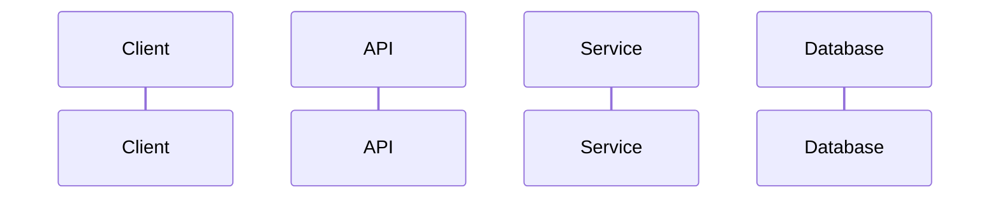

# Feature Plan: [Feature Name]

> **Status**: `DRAFT` | `IN_REVIEW` | `APPROVED` | `IN_PROGRESS` | `COMPLETE`
> **Created**: YYYY-MM-DD
> **Last Updated**: YYYY-MM-DD
> **Author**: [Engineer Name]
> **Agent**: Blueprint

---

## 1. Overview
[2-3 sentence summary of what this feature does and why it matters]

## 2. Motivation
[Business context. Why now? What problem does this solve? Who asked for it?]

## 3. Requirements

### Functional
- [ ] [Requirement 1]
- [ ] [Requirement 2]

### Non-Functional
- Performance: [targets]
- Availability: [SLA]
- Security: [requirements]

## 4. Technical Design

### 4.1 Data Model Changes
```
[Schema changes, new tables, modified columns]
```

### 4.2 API Contracts
```
[Method] [Path]
Auth: [required/optional]
Request:  { ... }
Response: { ... }
Errors:   { ... }
```

### 4.3 Business Logic
[Core algorithm, rules engine, calculation logic]

### 4.4 Sequence Diagram


### 4.5 Dependencies
- External services: [list]
- Internal services: [list]
- Libraries: [new dependencies]

## 5. Edge Cases & Error Handling
| Scenario | Expected Behavior |
|----------|-------------------|
| [edge case 1] | [handling] |
| [edge case 2] | [handling] |

## 6. Security & Compliance
- [ ] Auth/AuthZ requirements defined
- [ ] PII handling documented
- [ ] Audit trail requirements
- [ ] Regulatory considerations: [list]

## 7. Acceptance Criteria
- [ ] [AC 1: specific, testable condition]
- [ ] [AC 2: specific, testable condition]

## 8. Risk Register
| Risk | Impact | Likelihood | Mitigation |
|------|--------|------------|------------|
| [risk 1] | High/Med/Low | High/Med/Low | [mitigation] |

## 9. Rollback Plan
[How to safely revert this feature if issues arise post-deployment]

## 10. Open Questions
- [ ] [Question 1]
- [ ] [Question 2]

---

## Revision History
| Date | Change | Author |
|------|--------|--------|
| YYYY-MM-DD | Initial draft | Blueprint |
